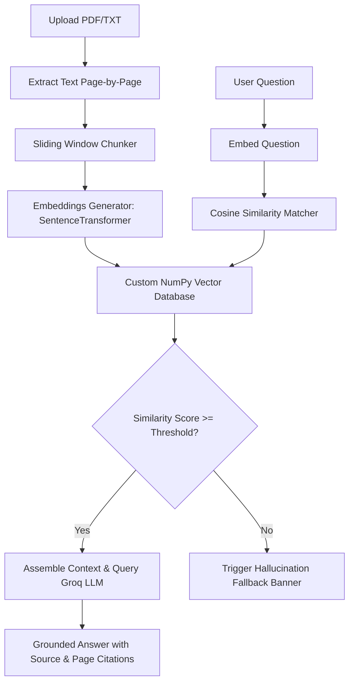

# 🧠 DeepRAG: Custom Retrieval-Augmented Generation (RAG) System

DeepRAG is an educational, production-ready RAG application built **completely from scratch without using AI frameworks like LangChain, LlamaIndex, or third-party Vector Databases**.

## 💡 What This Project Does

Plain LLMs suffer from **hallucinations**—they confidently make up facts when they lack specific knowledge. In business, HR, or product settings, this is unacceptable (e.g., an AI cannot confidently hallucinate an HR policy or product specification).

**DeepRAG** solves this problem by executing a Retrieval-Augmented Generation (RAG) pipeline:
1. **Upload Documents**: Users upload or point to a set of documents (PDFs, text files).
2. **Retrieve Context**: When a question is asked, the system converts the query into an embedding and calculates the cosine similarity to find the most relevant document sections.
3. **Generate Grounded Answers**: It feeds those matching sections into the Groq LLM under strict instructions to answer **only** using the context and provide **citations** (source file and page number) back to the source.
4. **Prevent Hallucinations**: If the query similarity falls below a configurable threshold, the app automatically triggers a fallback warning or blocks the LLM, protecting integrity.

---

## 🚀 How It Works (The Core Pipeline)



### 1. Ingestion & Extraction (`rag_engine.py`)
- **PDF Extraction**: Uses the lightweight `pypdf` package to extract text page-by-page. This ensures we can retain page numbers for granular citation matching.
- **TXT Extraction**: Decodes files directly in UTF-8.

### 2. Manual Sliding-Window Chunking (`rag_engine.py`)
- Instead of using a black-box splitter, we split text by splitting word arrays into chunks of configurable sizes (e.g., 300 words) with a sliding overlap (e.g., 50 words) to prevent thoughts from being cut off mid-sentence.

### 3. Local Sentence Embeddings (`rag_engine.py`)
- We use the `sentence-transformers/all-MiniLM-L6-v2` model locally via the `sentence-transformers` library. 
- It encodes each text chunk into a **384-dimensional float vector**.
- By running locally on CPU/GPU, we keep ingestion costs at **zero** and protect privacy.

### 4. Custom Vector Database (`rag_engine.py` -> `CustomVectorStore`)
- We store the generated vectors in a NumPy matrix.
- When a search is requested, we compute **Cosine Similarity** between the query vector $Q$ and all stored chunk vectors $D$:
  $$\text{Similarity}(Q, D) = \frac{Q \cdot D}{\|Q\| \|D\|}$$
- Results are filtered by document names and sorted by similarity descending.
- A `.pkl` file holds the serialized database for local persistence.

### 5. Fallback & Generation (`rag_engine.py` -> `query_groq_llm`)
- **Hallucination Prevention**: If the top similarity score is below the user-specified threshold, the system triggers a fallback banner and prevents LLM execution (in strict mode) to save API costs and block made-up answers.
- **Groq Integration**: The relevant context chunks are formatted alongside a strict system prompt instructing the model to reply using **only** the context provided and format inline citations.

---

## 🛠️ Tech Stack
- **Language**: Python 3.13+
- **Frontend**: Streamlit (with custom styles)
- **Embeddings**: `sentence-transformers` (model: `all-MiniLM-L6-v2`)
- **Vector Math**: NumPy
- **Parser**: `pypdf`
- **LLM API**: Groq Cloud SDK (`groq`)

---

## 💻 Setup & Running Locally

### 1. Clone the project and navigate to the directory
```bash
cd c:\Users\thebo\Desktop\aiPrject\knowledgebas
```

### 2. Create a virtual environment (Recommended)
```bash
python -m venv venv
# On Windows:
    .\venv\Scripts\activate
# On macOS/Linux:
source venv/bin/activate
```

### 3. Install dependencies
```bash
pip install -r requirements.txt
```

### 4. Set your Groq API Key (Optional)
You can set your API key as an environment variable, or simply paste it in the Streamlit sidebar text field at runtime:
```bash
# On Windows (PowerShell):
$env:GROQ_API_KEY="your-groq-api-key-here"

# On macOS/Linux:
export GROQ_API_KEY="your-groq-api-key-here"
```

### 5. Launch the Streamlit dashboard
```bash
streamlit run app.py
```

---

## 🔬 Interactive UI Features

- **📂 Live Document Loader**: Upload your own PDFs or TXT files, or load a pre-configured sample college handbook immediately.
- **📐 Real-Time Parameter Sliders**: Adjust Chunk Size, Chunk Overlap, and Top-K results instantly in the sidebar.
- **🛡️ Fallback Configurations**: Test strict similarity cutoffs to prevent hallucinations.
- **🔍 Under-The-Hood Vector Playground**: Inspect database statistics, browse individual chunk texts, and perform direct cosine similarity checks on any phrase, seeing visual similarity score metrics.

---

## 📤 Pushing to GitHub

To push this project to your GitHub repository, follow these steps:

### 1. Initialize Git in the project folder
```bash
git init
```

### 2. Create a `.gitignore` file
Create a file named `.gitignore` in the project root to prevent tracking virtual environments, credentials, or binary cache files:
```bash
# .gitignore
venv/
.env
__pycache__/
*.pkl
.streamlit/
```

### 3. Add and commit your changes
```bash
git add .
git commit -m "Initial commit: DeepRAG custom pipeline"
```

### 4. Create a repository on GitHub and push
Go to GitHub, create a new empty repository (without initializing README or gitignore), and run:
```bash
git branch -M main
git remote add origin https://github.com/YOUR_USERNAME/YOUR_REPO_NAME.git
git push -u origin main
```
